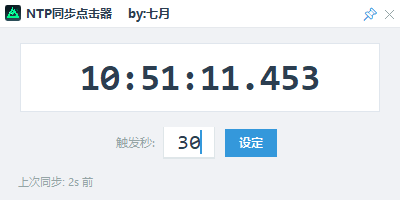

# ⏰ NTP同步点击器

一个轻量、精准的 NTP 时间同步工具，支持毫秒级时间显示与指定秒数自动点击触发。
三角洲撞车工具。

---

## 📋 功能特性
- 🕒 毫秒级高精度当前时间实时显示
- 🎯 自定义触发秒数，到达指定时间自动执行点击操作
- 🔄 记录并展示上次NTP时间同步状态，便于校验时间准确性
- 🎨 简洁友好的可视化操作界面，易上手

## 🖼️ 界面预览

> 注：图片展示了工具的核心操作界面，包含时间显示区、触发秒数设置区和状态提示区

## 🚀 快速使用
1. 程序启动后，主界面会自动显示当前NTP同步后的精确时间；
2. 在「触发秒」输入框中输入目标秒数（例如：`30`）；
3. 点击「设定」按钮，工具会在系统时间秒数到达设定值时自动触发点击动作；
4. 界面底部的「上次同步」区域会显示最近一次时间同步的时间戳，确认时间有效性。

## 📄 许可证
本项目采用 MIT 开源许可证 - 详见 [LICENSE](LICENSE) 文件。
